#  AI Studio

AI Studio recreates the playground interface and interaction experience of
Google AI Studio as a fully self-hosted web application. You can configure any
**Gemini** or **OpenAI-compatible** endpoint (custom Base URL, API key, proxy),
and all your data is stored in a **local embedded SQLite (libsql) database** —
nothing ever leaves your machine except the requests you send to your own API
endpoint.

This project is an **unofficial, educational open-source recreation** of the
Google AI Studio interface, built with Next.js 14. It is for **learning and
research purposes only** — it is not affiliated with, endorsed by, or sponsored
by Google, and it involves no commercial interests whatsoever.

## Features

### Core Playground

- 💬 Streaming (SSE) and non-streaming chat completions
- 🔌 Custom **Base URL / API key**, switchable protocol (**Gemini** or
  **OpenAI-compatible**), optional **HTTP proxy**
- 🤖 Model selector with live model listing, plus **custom model registration**
  (custom context window, category, description)
- ✏️ **Regenerate** a response from any point without affecting later turns
- 🔀 Conversation **branching / duplication**, context JSON **import & export**
- 📜 Lazy-loaded history with automatic pagination on scroll-to-top

### Tools

- Structured outputs (with a **JSON Schema editor**)
- Function calling (with a **declarations editor**)
- Code execution
- Grounding with Google Search / Google Maps
- URL context

### Configuration & Personalization

- 🎛️ Run settings panel: system instructions, temperature, top-p / top-k,
  max output tokens, thinking level, safety thresholds per harm category
- 🗂️ **System instruction templates** (save / apply / manage)
- 🌗 Theme: **dark / light / system**
- 🔒 **Password protection** with lock screen (optional, stored locally)
- 📊 Per-message and per-conversation **token usage** statistics

### Data & Voice

- 🗄️ **Local SQLite (libsql) database** — conversations, messages, settings
  and usage are all persisted on disk; the Dashboard shows DB size and contents
- 🗣️ **Edge-TTS** speech synthesis: multiple voices, adjustable volume / rate /
  pitch, per-message playback and **auto-read** mode for AI responses
- 📱 Fully **responsive** — desktop sidebar and mobile drawer layouts

## Demo Screenshots

Representative views of the application (all images live in
[`Pictures/`](Pictures/)):

| | |
| --- | --- |
| .png) | .png) |
| *Playground — dark theme* | *Playground — light theme* |
| 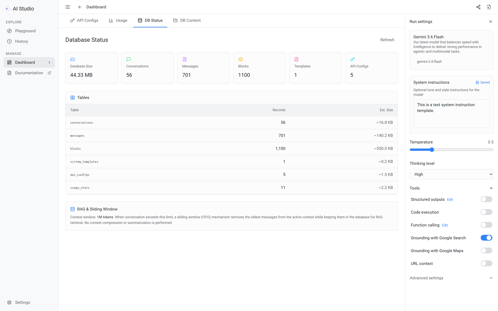 | 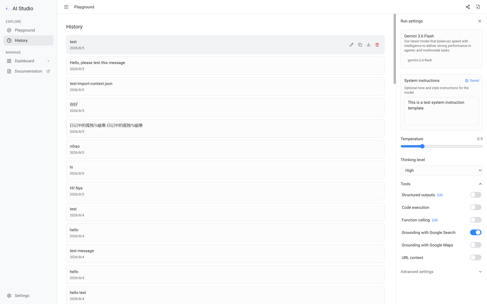 |
| *Dashboard — database & usage* | *History — conversation list* |

<details>
<summary><b>🖼️ Full screenshot gallery (click to expand)</b></summary>

### Interface & Themes

| | |
| --- | --- |
| .png) | .png) |
| *Home — mobile* | *Sidebar — mobile* |
| .png) | .png) |
| *Chat interface — dark* | *Chat interface — light* |

### Settings & Tools

| | |
| --- | --- |
| 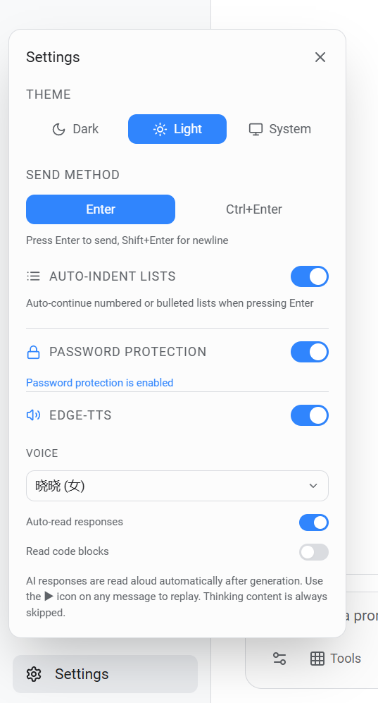 | 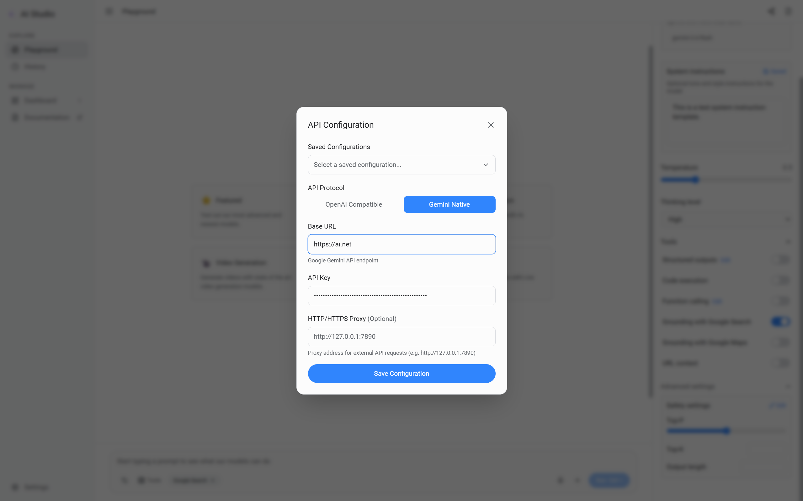 |
| *Settings window* | *API configuration* |
| 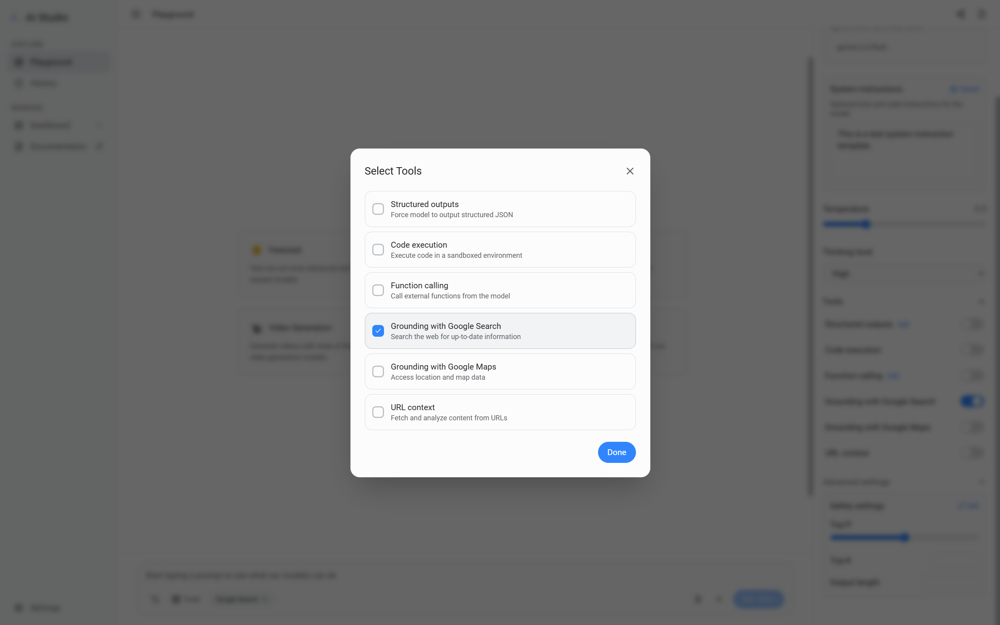 | 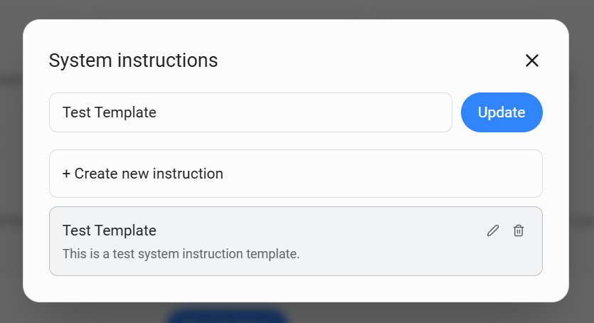 |
| *Tool selection* | *System instruction templates* |

### Models & Structured Output

| | |
| --- | --- |
| 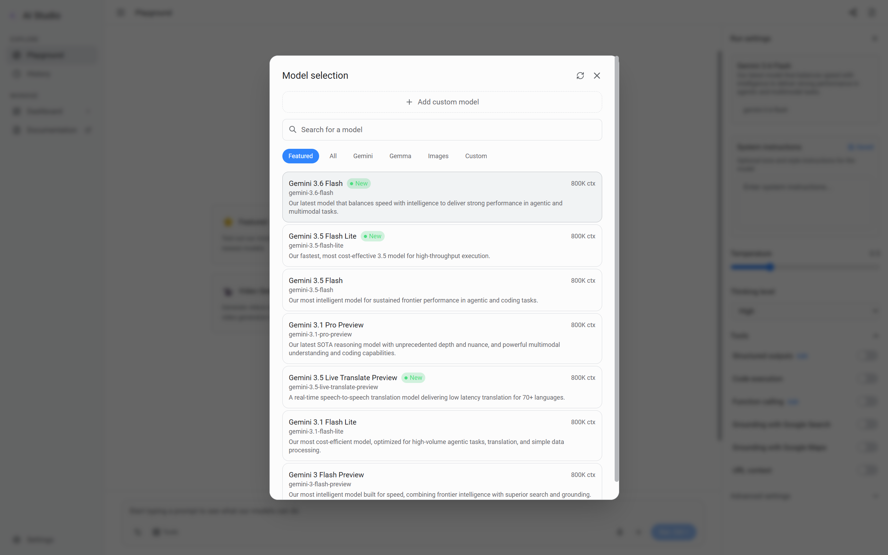 | 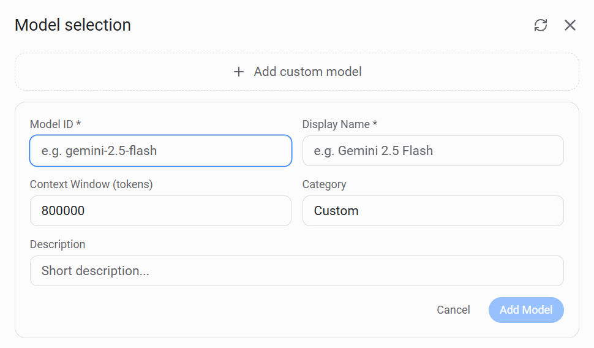 |
| *Model selection* | *Add custom model* |
| 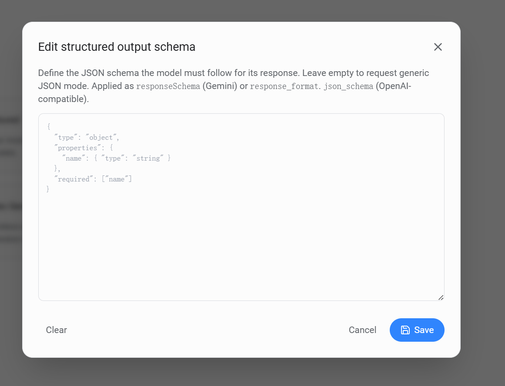 | 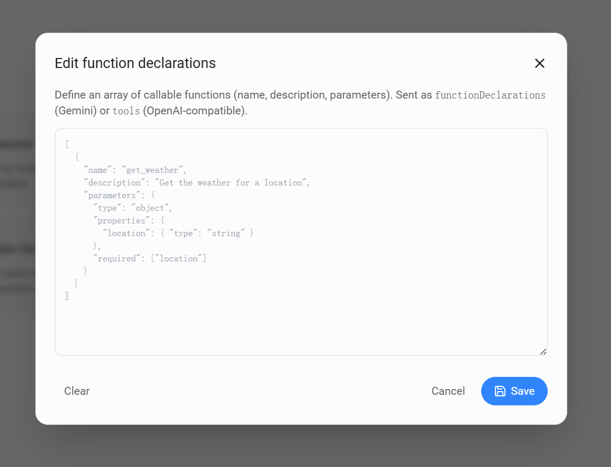 |
| *Structured output Schema editor* | *Function declarations editor* |

### Security

| | |
| --- | --- |
| 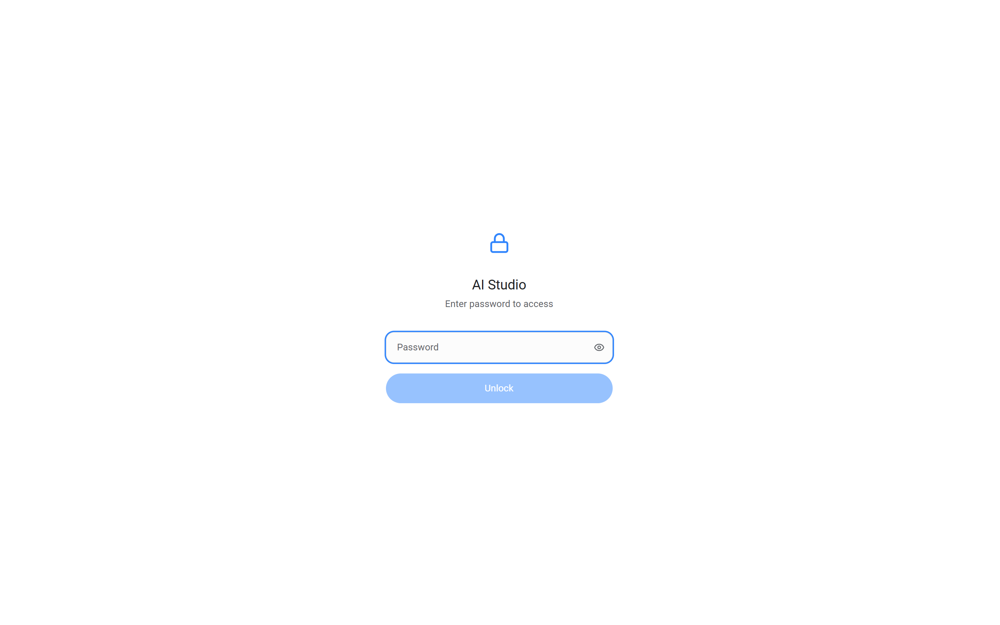 | .png) |
| *Password lock screen* | *Clear password* |

</details>

## Installation

```bash
git clone https://github.com/SRInternet-Studio/AIStudio.git
cd AIStudio
npm install
npm run dev
```

Open <http://localhost:3000>, click the **Settings button** at the bottom-left
of the input box, choose a protocol, enter your Base URL and API key, then
**select or add a custom model** in the run settings panel (right side) to
start chatting.

## Configuration

| Item | Where | Notes |
| --- | --- | --- |
| Base URL / API key / protocol / proxy | Bottom input box → Settings button (bottom-left) → API configuration | Persisted locally |
| System instructions & templates | Run settings panel (right side) | Templates saved to DB |
| Password protection | Settings window | Optional lock screen |
| Theme | Settings window | dark / light / system |

## Project Structure

```
├── src/
│   ├── app/            # Next.js App Router pages + API routes
│   │   └── api/        # force-dynamic backend endpoints
│   ├── components/     # chat, layout, settings, dashboard, documentation
│   ├── lib/            # db (libsql), api-client, context manager, models
│   ├── store/          # Zustand global state
│   └── types/          # Shared TypeScript types
├── public/             # Static assets (logo)
├── Pictures/           # Demo screenshots
├── Docs/               # Chinese documentation
└── data/               # Local SQLite database (auto-created)
```

## Scripts

| Command | Description |
| --- | --- |
| `npm run dev` | Start the development server |
| `npm run build` | Production build |
| `npm run start` | Serve the production build |
| `npm run lint` | Run ESLint |

## Documentation

In-app documentation is available under **Manage → Documentation** (English /
中文 switchable). Source files: [WELCOME](WELCOME.md) ·
[DEVELOPMENT](DEVELOPMENT.md) · [SECURITY](SECURITY.md) ·
[CONTRIBUTING](CONTRIBUTING.md) · [CODE_OF_CONDUCT](CODE_OF_CONDUCT.md) ·
[DISCLAIMER](DISCLAIMER.md) — Chinese versions in [`Docs/`](Docs/).

## Disclaimer

This project is an open-source educational recreation of Google AI Studio.
It is **not affiliated with Google** and involves **no commercial interests**.

**AI models may make mistakes, so double-check outputs.** See
[DISCLAIMER](DISCLAIMER.md) for details.

## License

[Apache License v2.0](LICENSE.md).
